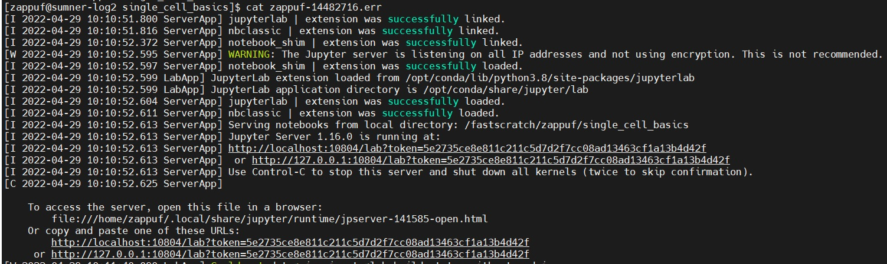
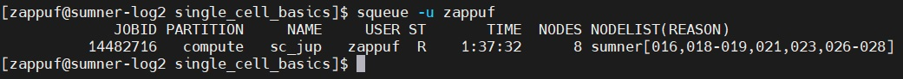

# Alternate Output for Jupyter.sh Script

If you used the jupyter.sh script and the output of the `.err` file does not include a URL with `sumner` in it, then please follow the instructions here. The output you do see should look similar to below

1. First we need to figure out the correct node on `sumner` so we will use the `squeue` command to determine it.

- `squeue -u $USER`
    - your output will look similar to this. In this particular case, we will use `016` as the node because that is the first node listed in the list for this `job id`
    - 

2. Copy either of the URLs from the `.err` file. You should `cat` or `tail` this file to print it to the screen first.

3. Paste the URL you copied in step #2 into your web browser. Do not hit the enter/return key yet.

4. Replace `localhost` or `127.0.0.1` (depending on which URL you copied) with `sumner016.sumner.jax.org`. The `016` here could be a different number depending on what you see in step #1 above. Make sure you do not remove the `:` In this particular case the complete URL that will be used to access Jupyter Lab is `http://sumner016.sumner.jax.org:10804/lab?token=5e2735ce8e811c211c5d7d2f7cc08ad13463cf1a13b4d42f`

5. Return to the [README](README.md#Getting-Jupyter-Lab-Started) and continue at step #8.